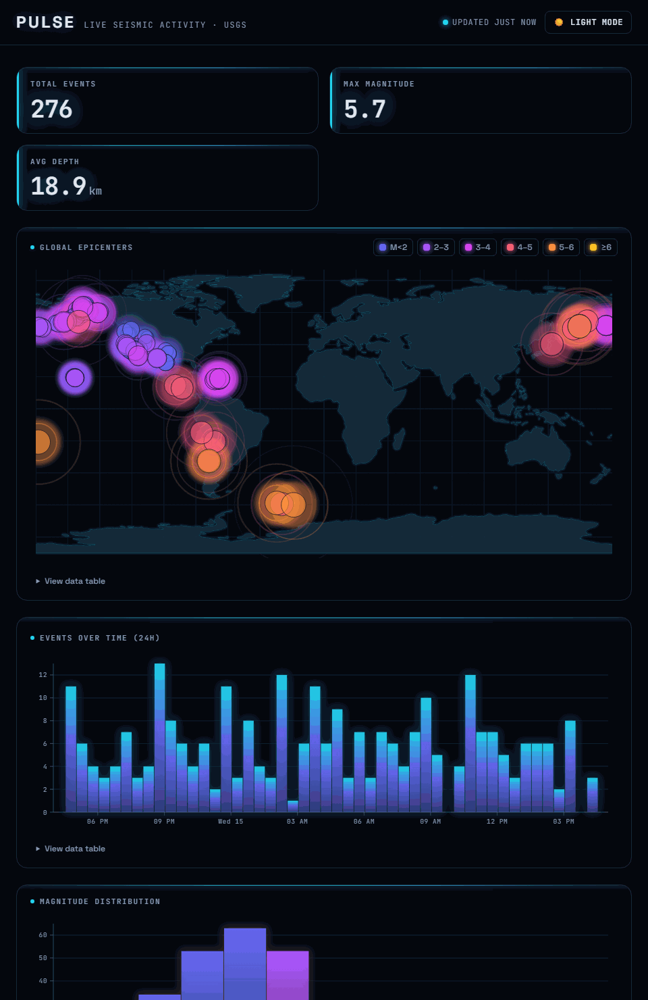
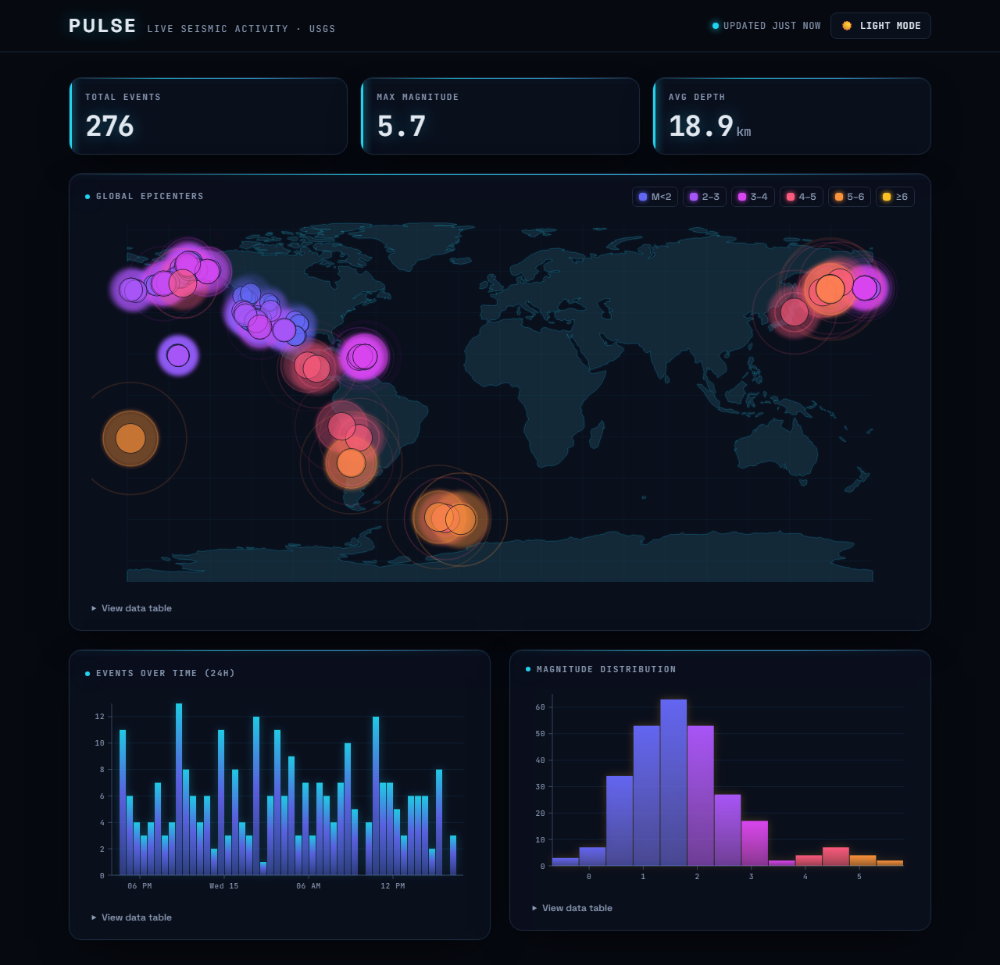
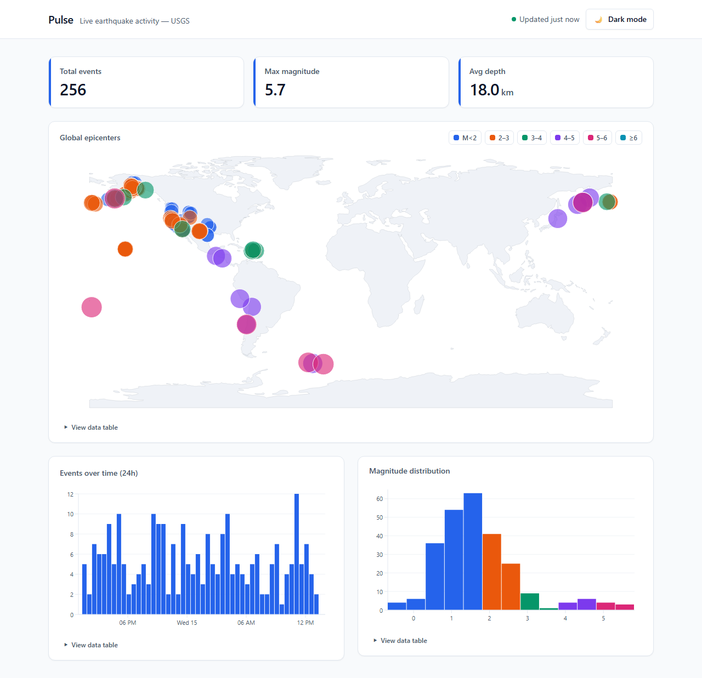

# Pulse — Live Earthquake Analytics

### ▶ [Live demo](https://pulse-eight-gamma-93.vercel.app) · deployed on Vercel

A fluid, animated analytics dashboard built on the **live USGS earthquake feed**.
No API key, no backend — one real data source, deeply visualized and cross-filtered.
The point isn't the numbers; it's the *interaction*: brush a time range and every
panel filters instantly, hover one map point and the same event highlights across
all charts, toggle a magnitude series and it animates out everywhere.

> Stack: React 18/19 + TypeScript (strict) · Vite · TanStack Query · Zustand ·
> hand-built D3-in-React SVG charts · Tailwind (light/dark) · Vitest + Playwright.
> Dev server: `pnpm dev` → http://localhost:5175



*Drag a time window on the time-series and the map, histogram, and KPIs all filter
to it instantly — then clear it and everything animates back.*

<p align="center">
  
  
</p>

## What it does

- **KPI tiles** — total events, max magnitude, average depth. Count up on load and
  recompute for whatever is currently selected.
- **Events over time** — a 30-minute-binned time-series of the last 24h with smooth
  enter/update transitions on each refresh.
- **Magnitude distribution** — a histogram of event magnitudes, colored by an
  accessible categorical palette.
- **Global epicenters** — a D3 geo-scatter world map; points sized *and* colored by
  magnitude, plotted on a bundled world TopoJSON (no map tiles, no token).

### The interactions that matter

- **Brush to cross-filter.** Drag across the time-series to select a window; the
  histogram, map, and KPIs filter to that window instantly, with animated
  transitions. The time-series itself keeps the full 24h context so the selection
  stays visible and adjustable.
- **Synchronized hover.** Hovering a map point sets one shared "hovered event"; the
  time-series highlights the *time bin* that contains it and the histogram
  highlights the *magnitude bucket* — one hover, three linked responses.
- **Pin a point.** Click a map point to pin a detail card (place, magnitude, depth,
  precise time, coordinates, a link to the USGS event page). Escape or Close unpins.
- **Legend series toggles.** The magnitude legend doubles as a filter — toggle a
  bucket and those events animate out of every panel at once.

## Design — "Seismic Mission-Control"

A cinematic, dark, ops-room aesthetic that leans into the name: earthquakes
literally **pulse**. On the world map, significant quakes emit expanding sonar
rings (staggered so it reads as a living field, not a strobe) over a faint
graticule grid and glowing continent outlines; every epicenter carries a colored
glow. Magnitude uses a **sequential "heat" ramp** (indigo→amber, monotonic
luminance — a plasma-style scale that's colorblind-safe and reads as intensity),
reserved separately from an electric-cyan UI accent. Glass panels, glowing mono
figures, gradient chart bars, and a staggered first-load entrance complete it.

All motion — ripples, background drift, bar draw-in, count-ups, the entrance — is
gated behind `prefers-reduced-motion` and animates only `transform`/opacity, so it
tweens smoothly in every browser (including WebKit/Safari) and goes fully still for
users who ask for reduced motion. A clean light "day-ops" theme is included.

## Architecture

### Data pipeline

```
fetch USGS all_day.geojson  (TanStack Query: refetch 60s, staleTime 30s)
  → normalizeQuakes()   GeoJSON features → Quake[] {id,time,mag,depth,lat,lng,place}
  → useVisibleQuakes()  data − legend-hidden magnitude buckets
  → useFilteredQuakes() visible ∩ brush time-range
  → KPI tiles + histogram + geo map    (the time-series reads useVisibleQuakes so it
                                         keeps full time context while others filter)
```

Two orthogonal filter dimensions — **legend series visibility** and the **brush
time-range** — compose into a single memoized `useFilteredQuakes()` that is the one
source of truth every filtering panel consumes. Cross-filtering is therefore almost
free: a panel doesn't know *why* the data narrowed, it just re-renders the
`filteredQuakes` it's given.

### D3-in-React: D3 does the math, React owns the DOM

Every chart is hand-built SVG. D3 is used **only** for computation — `scaleTime`,
`scaleLinear`, `geoEquirectangular`, `geoPath`, tick math — and the results are
rendered as JSX (`<rect>`, `<circle>`, `<path>`, `<g>`). There is no
`d3.select().append()` anywhere; React reconciles every node. This keeps the charts
declarative, testable, and free of the dual-ownership bugs that come from letting D3
mutate a React-managed tree.

Bars animate via a CSS `transform: scaleY()` on full-height rects (not the SVG
`y`/`height` attributes, which WebKit/Safari won't transition) so updates tween
smoothly in every browser — and the inline transform is the correct final geometry
even if no animation runs.

### Linked-interaction state (Zustand)

A single store holds the cross-panel UI state — `brushRange`, `hoveredQuakeId`,
`pinnedQuakeId`, `hiddenSeries` — deliberately separate from the server cache
(TanStack Query). A 60s refetch swaps the data without disturbing your selection;
the brush and pin survive it. Panels subscribe to just the slice they need.

## Definition of Done

- **Performance** — 60fps interactions on the full live dataset; memoized derived
  data and scales.
- **Responsive + touch** — grid stacks on mobile, charts reflow, map point sizing
  scales down, brush/pin/legend all work by touch (pointer events).
- **Dark mode** — full light/dark with an accessible categorical palette designed
  for both themes (not inverted); magnitude is encoded by size *and* color so hue is
  never the only signal.
- **Accessibility** — chart ARIA roles/labels, a keyboard-navigable "View data
  table" fallback under every chart, visible focus, color never the sole signal.
- **States** — loading skeletons, context-aware empty states (no-data / brush-empty
  / all-series-hidden), an error state with retry, and a live "updated Ns ago"
  freshness indicator.
- **Code quality** — TypeScript strict, no `any`, ESLint/Prettier clean, no console
  errors.

## Running it

```bash
pnpm install
pnpm dev        # http://localhost:5175
pnpm test       # Vitest — data transforms, scales, store, brush, empty-state logic
pnpm typecheck  # tsc --noEmit (strict)
pnpm lint       # eslint
pnpm build      # production build
```

Playwright end-to-end tests live in `e2e/` (chart render + brush cross-filter).
The `scripts/*-proof.mjs` helpers drive the app headlessly to verify each
interaction and data-state.

## Data & attribution

- Earthquakes: [USGS Earthquake Hazards Program](https://earthquake.usgs.gov/) —
  `all_day.geojson` summary feed (public, no key).
- World map: [world-atlas](https://github.com/topojson/world-atlas) land TopoJSON
  (Natural Earth, public domain).

## Non-goals

No backend, no auth, no writing data back, no CSV upload. One live source,
beautifully visualized and deeply interactive.
